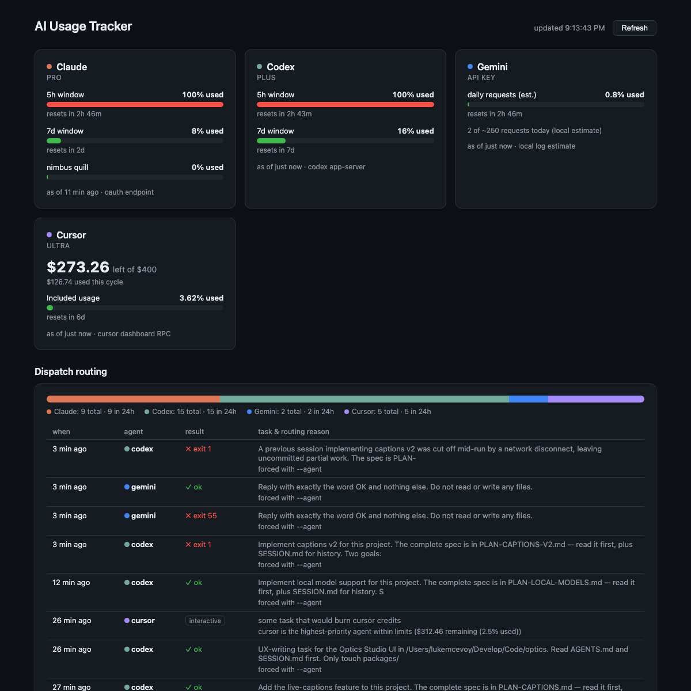

# AI Usage Tracker

Local dashboard showing how much usage you have left on your **Claude**,
**Codex**, **Gemini**, and **Cursor** accounts — plus an `ai` command that
routes coding tasks to whichever account has the most quota. Zero dependencies
(Python 3 stdlib only), everything runs on your machine, and no tokens ever
leave it.



```text
$ ./ai --status
usage-tracker dispatcher

  claude   pro      eligible  headroom  77.0%
           5h window at 23% used

  codex    plus     eligible  headroom 100.0%
           5h window at 0% used

  cursor   ultra    eligible  headroom  99.7%
           $388.70 remaining (0.32% used)

→ would dispatch to: claude (claude is the highest-priority agent within limits)
```

## Run

```bash
python3 server.py
```

Then open <http://127.0.0.1:8899>. The page auto-refreshes every minute;
the Refresh button forces a re-fetch.

## How each service is read

| Service | Data source | Freshness |
|---------|-------------|-----------|
| Claude  | Statusline hook snapshot (`~/.claude/usage-snapshot.json`), with the OAuth usage endpoint as backup | Live while you use Claude Code |
| Codex   | `codex app-server` JSON-RPC (`account/rateLimits/read`) | Live |
| Gemini  | Prompt count from local session logs vs the documented daily limit | Local estimate |
| Cursor  | Access token from Cursor's local state DB → dashboard API | Live |

### Claude details

Anthropic's `/api/oauth/usage` endpoint rate-limits aggressively (~5 calls per
access token), so the primary source is a Claude Code **statusline hook**
(`claude_statusline.py`, wired into `~/.claude/settings.json`). Claude Code
pipes rate-limit data to it after every assistant message; the hook saves a
snapshot the dashboard reads. The OAuth endpoint is still tried at most every
15 minutes (1-hour backoff after a 429) so data can refresh even when Claude
Code is idle.

Consequence: right after setup the Claude card may say "no usage data yet" —
run any Claude Code prompt once and it will populate.

### Cursor details

The access token is read (read-only) from
`~/Library/Application Support/Cursor/User/globalStorage/state.vscdb` and used
against the same endpoints the cursor.com dashboard uses. If Cursor changes
its auth, re-login in Cursor and the token refreshes automatically.

### Codex details

Spawns `codex app-server` and asks over JSON-RPC. Requires the `codex` CLI to
be logged in (`codex login`).

### Gemini details

Google only exposes a quota API for Google-account login, and this machine
uses API-key auth — so the card is an **estimate**: prompts logged today in
`~/.gemini/tmp/*/logs.json` against the documented daily limit (250/day for
the free API-key tier, 1,000+/day for Google login). Real API-call counts run
somewhat higher than prompt counts. Set `GEMINI_DAILY_LIMIT` if on a paid
tier. Switching the CLI back to Google login (`/auth` inside `gemini`) both
raises the daily limit and would allow real quota data via the Code Assist
API — a good future upgrade.

## Caveats

- All three data sources are unofficial/undocumented and may break when
  vendors change their APIs.
- Cached state lives in `~/.cache/usage-tracker/`.
- The server binds to 127.0.0.1 only.

## The ai dispatcher

`./ai` hands a coding task to whichever vendor CLI still has quota left. It
reads the same usage data as the dashboard, picks an agent, and execs that
vendor's CLI (`claude`, `codex`, `gemini`, or `cursor-agent`) with your task.

```bash
./ai                                  # status only: who is eligible, who would win
./ai --status                         # same thing, explicitly
./ai "fix the flaky test in test_router.py"   # route and launch interactively
./ai -p "summarise the diff on this branch"   # headless: run and print, no TUI
./ai --agent codex "port this module to async"  # skip routing, force an agent
./ai --no-journal "quick one-off question"      # no SESSION.md preamble or record
```

Symlink it onto your `PATH` (e.g. `ln -s "$PWD/ai" ~/.local/bin/ai`) and it
still works — it resolves its own location to find the `dispatcher` and
`providers` packages, so it can be run from any directory.

### How routing works

Every invocation walks the same decision procedure (implemented in
`dispatcher/routing.py`, unit-tested in `tests/test_routing.py`):

```text
1. read live usage        tracker server (3s timeout) → provider fallback
2. assess every agent     installed? data readable? under its threshold?
       headroom = 100 - worst-window-used%   (claude, codex)
       headroom = 100 - percent_used         (cursor)
3. pick, in this order:
       a. first agent in `priority` that is eligible with known headroom
       b. first eligible agent whose usage is unknown (tracker gap ≠ blocked)
       c. everyone over limits → the installed agent with the most headroom
       d. no CLI installed at all → refuse with an explanation
4. launch & log           the decision, reason, task, and exit code are
                          appended to the dispatch log (see Analytics)
```

An agent is skipped in step 2 if its CLI is not installed, if its usage could
not be read, or if it is over its threshold:

| Agent  | Eligible while |
|--------|----------------|
| Claude | worst rate-limit window is under `max_window_percent` used |
| Codex  | worst rate-limit window is under `max_window_percent` used |
| Gemini | estimated daily requests under `max_window_percent` used |
| Cursor | at least `min_remaining_usd` left in the billing cycle |

Reserve agents (`cursor` by default) are always considered last: any eligible
non-reserve agent — even one whose usage could not be read — wins over an
eligible reserve agent, because reserve credits do not refill on a rolling
window.

`ai --status` prints the full assessment — every agent, its headroom, and why
it is eligible or blocked — so you can always see what step 3 would do before
committing a task.

### Analytics

Every dispatch is appended to `~/.cache/usage-tracker/dispatches.jsonl` — one
JSON object per line with the timestamp, chosen agent, the routing reason,
whether it was forced with `--agent`, the task (first 140 chars), mode, exit
code (headless runs only; interactive runs replace the process), and the
working directory.

The dashboard's **Dispatch routing** section reads this log via
`GET /api/dispatches`: a share bar of which agents your tasks actually land
on, per-agent counts (total / last 24 h), and the most recent dispatches with
their routing reasons and results. Use it to sanity-check your thresholds —
e.g. if everything lands on one agent, its threshold is too generous or the
others' too strict.

### Config

Optional, at `~/.config/usage-tracker/dispatcher.json`. Anything you omit
falls back to the defaults shown here:

```json
{
  "priority": ["claude", "codex", "cursor"],
  "thresholds": {
    "claude": { "max_window_percent": 85 },
    "codex": { "max_window_percent": 85 },
    "cursor": { "min_remaining_usd": 25.0 }
  },
  "tracker_url": "http://127.0.0.1:8899/api/usage"
}
```

Reorder `priority` to prefer a different agent, or raise a threshold to keep
using a service closer to its limit.

### Quota breaks (protecting the reserve)

Cursor is a **reserve** agent by default: its billing-cycle dollars do not
refill every five hours the way Claude's and Codex's windows do, so blowing
through them in a day of rate-limited afternoons is easy. When a dispatch
would land on a reserve agent (or on nothing, or on an agent that is itself
over its limits) *and* some preferred agent is only threshold-blocked with a
window that resets within `wait.max_wait_minutes`, `ai` takes a quota break
instead:

```text
quota break: codex's rate-limit window resets around 11:58 PM (~189 min).
Waiting instead of spending cursor credits — Ctrl+C to stop, or rerun with
--now to dispatch immediately.
```

It sleeps until the earliest useful reset (an agent counts as usable again
only when **all** of its over-threshold windows have reset), then re-fetches
usage with caches bypassed and re-routes, resuming only on a genuinely
eligible non-reserve agent. If the data still shows the agent blocked after a
`grace_minutes` polling period, it gives up with an explanation rather than
silently spending the reserve. `--now` skips the wait entirely.

Config keys (all under the defaults shown above): `reserve` (list of agents of
last resort), `wait.enabled`, `wait.max_wait_minutes` (don't wait longer than
this; longer resets fall through to the reserve), `wait.poll_seconds`, and
`wait.grace_minutes`.

### SESSION.md journal

Because a task may land on a different model each time, `ai` keeps a shared
handoff journal in **the directory you run it from** (not in this repo):

- the task prompt is prefixed with a short instruction block telling the agent
  to read `SESSION.md` first if it exists, and to append a dated handoff entry
  (what was done, key decisions, anything unresolved) when it finishes;
- `ai` itself appends a one-line dispatch record before launching:

```markdown
# Session journal

- 2026-08-26 18:55 — dispatched to codex: port this module to async
```

So the next session — whichever model gets it — starts by reading what the
previous one did. Use `--no-journal` to opt out for a single run.
